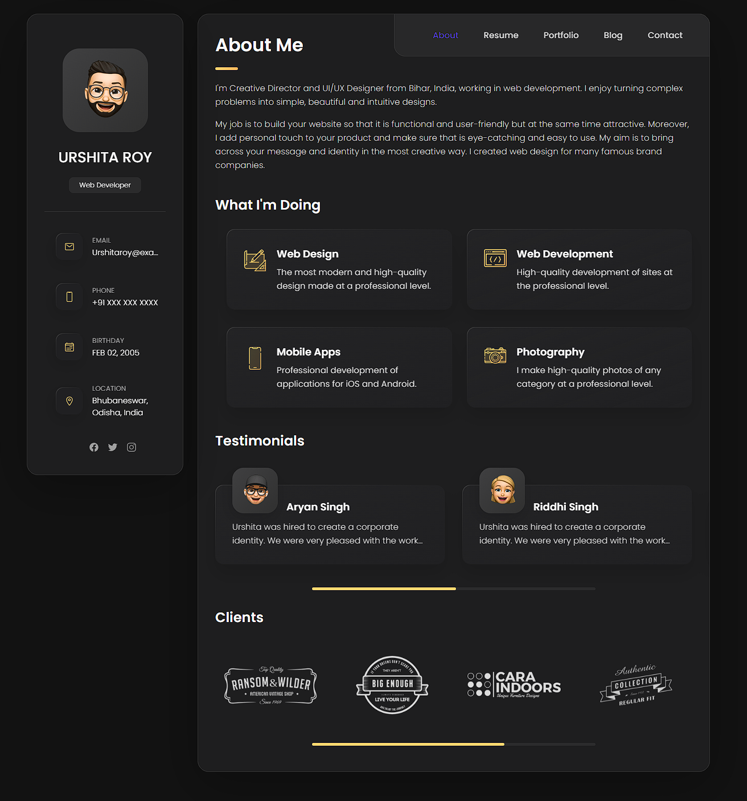

# 🌐 Urshita Roy — Personal Portfolio

> A modern, dark-themed personal portfolio website for **Urshita Roy** — Creative Director, UI/UX Designer, and Web Developer from Bihar, India.

---

## 📸 Preview



---

## 🧑‍💼 About

This is a fully responsive single-page portfolio showcasing Urshita Roy's skills, services, testimonials, and client work. Built with clean HTML, CSS, and JavaScript — no frameworks required.

**Personal Info:**
- 📍 Location: Bhubaneswar, Odisha, India
- 🎂 Birthday: Feb 02, 2005
- 💼 Role: Web Developer & Creative Director
- 📧 Email: Urshitaroy@example.com
- 📱 Phone: +91 XXX XXX XXXX

---

## ✨ Features

- **Sidebar profile card** — avatar, contact details, and social links always visible
- **Multi-section layout** — About, Resume, Portfolio, Blog, Contact via tabbed navigation
- **What I'm Doing** — services grid with icon cards
- **Testimonials** — client review carousel with avatar and quote
- **Clients** — logo strip of brand partnerships
- **Dark theme** — sleek dark charcoal UI with golden accent highlights
- **Fully responsive** — adapts seamlessly across desktop, tablet, and mobile

---

## 🛠️ Services

| Service | Description |
|---|---|
| 🎨 Web Design | Modern, high-quality design at a professional level |
| 💻 Web Development | High-quality development of sites at the professional level |
| 📱 Mobile Apps | Professional development of applications for iOS and Android |
| 📷 Photography | High-quality photography of any category at a professional level |

---

## 🏗️ Tech Stack


- **HTML5** — semantic structure and layout
- **CSS3** — custom dark theme, grid/flexbox, animations
- **JavaScript** — tab switching, interactive UI, smooth scrolling

---

## 📁 Project Structure

```
Personal-portfolio/
│
├── index.html          # Main HTML file (single-page app)
├── assets/
│   ├── css/
│   │   └── style.css   # Main stylesheet
│   ├── js/
│   │   └── script.js   # Tab navigation & interactions
│   └── images/         # Avatar, client logos, testimonial photos
└── README.md
```

---

## 🚀 Getting Started

### 1. Clone the repository

```bash
git clone https://github.com/urshita-web/Personal-portfolio.git
```

### 2. Open in browser

```bash
cd Personal-portfolio
open index.html
```

> No build tools or dependencies required — just open `index.html` directly in any modern browser.

---

## 🎨 Color Palette

| Role | Color | Hex |
|---|---|---|
| Background | Dark Charcoal | `#1e1e1f` |
| Card Surface | Dark Grey | `#2b2b2c` |
| Accent / Highlight | Golden Yellow | `#d4a843` |
| Primary Text | White | `#ffffff` |
| Secondary Text | Light Grey | `#a8a8b3` |
| Border | Subtle Grey | `#383838` |

---

## 🔗 Navigation Sections

| Tab | Content |
|---|---|
| **About** | Bio, services grid, testimonials, clients |
| **Resume** | Education, experience, skills |
| **Portfolio** | Project showcase with filters |
| **Blog** | Articles and posts |
| **Contact** | Contact form and map |

---

## 🤝 Clients Featured

- **Ransom & Wilder** — American Vintage Shop
- **Big Enough** — Lifestyle Brand
- **Cara Indoors** — Unique Furniture Design
- **Authentic Collection** — Regular Fit Fashion

---

## 💬 Testimonials

> *"Urshita was hired to create a corporate identity. We were very pleased with the work..."*
> — **Aryan Singh**

> *"Urshita was hired to create a corporate identity. We were very pleased with the work..."*
> — **Riddhi Singh**

---

## 🌍 Connect

[](https://github.com/urshita-web)
[](https://facebook.com)
[](https://twitter.com)
[](https://instagram.com)

---

## 📄 License

This project is open source and available under the [MIT License](LICENSE).

---

<p align="center">
  Made with ❤️ by <a href="https://github.com/urshita-web">Urshita Roy</a>
</p>
